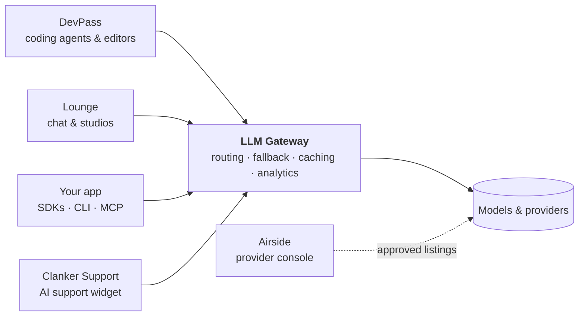

<div align="center">

<picture>
  <source media="(prefers-color-scheme: dark)" srcset="https://raw.githubusercontent.com/theopenco/.github/main/profile/assets/logo-dark.svg">
  
</picture>

### One API for every model — and the products we build on top of it

[](https://github.com/theopenco/llmgateway)
[](https://github.com/theopenco/llmgateway/blob/main/LICENSE)
[](https://docs.llmgateway.io)
[](https://discord.gg/3u7jpXf36B)
[](https://x.com/llmgateway)

**[Website](https://llmgateway.io)** · **[Models](https://llmgateway.io/models)** · **[Providers](https://llmgateway.io/providers)** · **[Pricing](https://llmgateway.io/pricing)** · **[Docs](https://docs.llmgateway.io)** · **[Status](https://status.llmgateway.io)** · **[Changelog](https://llmgateway.io/changelog)**

</div>

---

We build open-source infrastructure for the multi-model era. One OpenAI-compatible endpoint routes to **[every major provider](https://llmgateway.io/providers)** with smart routing, automatic fallback, caching, cost analytics and guardrails. DevPass brings it to coding agents, Lounge brings it to everyday creative work, and Airside lets providers bring their APIs onto the network.



<br />

## Products

| Product                                           | What it is                                                                                      |
| :------------------------------------------------ | :---------------------------------------------------------------------------------------------- |
| **[LLM Gateway](https://llmgateway.io)**          | One API key, every model. Routing, fallback, caching, spend analytics. Cloud or self-hosted.    |
| **[DevPass](https://devpass.llmgateway.io)**      | One coding subscription across supported agents and editors, with a monthly usage allowance.    |
| **[Lounge](https://lounge.llmgateway.io)**        | AI chat, group conversations, image, video, audio, voice and canvas. Credits or a membership.   |
| **[Airside](https://airside.llmgateway.io)**      | The provider console: list your API, verify model capabilities, file pricing and track traffic. |
| **[Clanker Support](https://clankersupport.com)** | Open-source AI support widget that answers from your docs and escalates with full context.      |

<br />

## ⚡ LLM Gateway

**One endpoint in front of every model.** Point the OpenAI SDK at us, change the base URL, and you're done — no rewrites, no per-provider glue code. Requests retry transparently on a healthy provider when one degrades, and every token lands in your usage dashboard.

<picture>
  <source media="(prefers-color-scheme: dark)" srcset="https://raw.githubusercontent.com/theopenco/.github/main/profile/assets/gateway-dark.png">
  
</picture>

- **Build across modalities** — OpenAI-compatible chat, streaming, tools, structured output and vision, plus image, video and audio APIs
- **Smart routing & fallback** — choose providers by cost, latency or throughput, with retries across eligible providers
- **Cost-aware analytics** — spend, tokens, cache hits and errors broken down by model, provider and project
- **Pay at provider rates** — flat 5% platform fee on credits, or free with your own keys (BYOK)
- **Organization controls** — budgets and access policies, with enterprise SSO, audit logs and compliance controls
- **Run it yourself** — AGPL-3.0 core, with Docker, Docker Compose and Kubernetes deployment guides

<details>
<summary><b>Try the API</b></summary>

<br />

```bash
curl https://api.llmgateway.io/v1/chat/completions \
  -H "Authorization: Bearer $LLM_GATEWAY_API_KEY" \
  -H "Content-Type: application/json" \
  -d '{
    "model": "auto",
    "messages": [{ "role": "user", "content": "Hello!" }]
  }'
```

Use `auto` for automatic model selection, or choose a model ID from the [live catalogue](https://llmgateway.io/models).

For self-hosting, start with the [single-container Docker guide](https://docs.llmgateway.io/self-host/docker), or use [Docker Compose](https://docs.llmgateway.io/self-host/docker-compose) for separate services.

</details>

<picture>
  <source media="(prefers-color-scheme: dark)" srcset="https://raw.githubusercontent.com/theopenco/.github/main/profile/assets/analytics-dark.png">
  
</picture>

<br />

## 🎟️ DevPass

**One subscription for your AI coding tools.** Use [DevPass Code](https://github.com/theopenco/devpass-code), our terminal agent, or connect a supported editor or coding agent with the same DevPass key. Usage is metered at provider rates against your plan allowance, with automatic provider routing and optional pay-as-you-go overflow. See the [current plans and limits](https://devpass.llmgateway.io/pricing) for allowances and fair-use rules.

<picture>
  <source media="(prefers-color-scheme: dark)" srcset="https://raw.githubusercontent.com/theopenco/.github/main/profile/assets/devpass-dark.png">
  
</picture>

```bash
pnpm add -g devpass-code   # or: brew install theopenco/tap/devpass-code
devpass-code auth login # opens your browser — no keys to copy, models built in
```

→ **[devpass.llmgateway.io](https://devpass.llmgateway.io)** · [DevPass Code repo](https://github.com/theopenco/devpass-code) · [setup guide](https://llmgateway.io/guides/devpass-code)

<br />

## 🥂 Lounge

**Your models and creative studios in one place.** Switch models mid-conversation, compare their answers in group chat, and generate images, video and speech. Projects keep your knowledge together; canvas, voice and reusable skills extend the workspace. Start with pay-as-you-go credits or choose a [membership](https://lounge.llmgateway.io/pricing).

<picture>
  <source media="(prefers-color-scheme: dark)" srcset="https://raw.githubusercontent.com/theopenco/.github/main/profile/assets/lounge-dark.png">
  
</picture>

→ **[lounge.llmgateway.io](https://lounge.llmgateway.io)**

<br />

## ✈️ Airside

**Bring your LLM API onto LLM Gateway.** Airside is the self-serve console for model providers. Verify your company domain, claim an existing provider or register a new one, and submit your models for review.

- **Manage your fleet** — list models, declare capabilities and run preflight checks against your endpoint.
- **File your pricing** — submit launch prices, regional rates and later changes for approval before they take effect.
- **Track your service** — monitor requests, tokens and errors by model, and investigate incidents.
- **Tune your offering** — submit traffic discounts and gateway margin changes for review, and invite your team to manage the provider together.

Approved listings become available through the same API developers already use. See [listing fees and terms](https://airside.llmgateway.io/pricing.md) before registering.

→ **[airside.llmgateway.io](https://airside.llmgateway.io)** · [provider guide](https://docs.llmgateway.io/features/airside)

<br />

## Developer tools

- **[VS Code extension](https://github.com/theopenco/llmgateway-vscode)** — use gateway models in VS Code chat and agent mode, including with a DevPass key.
- **[CLI](https://docs.llmgateway.io/developers/cli)** — launch coding agents, scaffold projects, discover models and manage keys, budgets and usage.
- **[MCP server](https://docs.llmgateway.io/developers/mcp)** — give assistants access to account analytics, model discovery, text and image generation.
- **[Vercel AI SDK provider](https://github.com/theopenco/llmgateway-ai-sdk-provider)** — integrate the gateway into AI SDK applications.

<br />

## Open source

| Repository                                                                                | What it is                                                  |
| :---------------------------------------------------------------------------------------- | :---------------------------------------------------------- |
| **[llmgateway](https://github.com/theopenco/llmgateway)**                                 | Gateway, dashboards, DevPass, Lounge, Airside, CLI and docs |
| **[devpass-code](https://github.com/theopenco/devpass-code)**                             | Terminal coding agent for LLM Gateway (a fork of opencode)  |
| **[llmgateway-vscode](https://github.com/theopenco/llmgateway-vscode)**                   | Native model provider for VS Code chat and agent mode       |
| **[llmchat](https://github.com/theopenco/llmchat)**                                       | Clanker Support: AI support widget and team inbox           |
| **[llmgateway-templates](https://github.com/theopenco/llmgateway-templates)**             | Starter templates for building AI apps on the gateway       |
| **[agent-skills](https://github.com/theopenco/agent-skills)**                             | Agent skills — image generation best practices and more     |
| **[llmgateway-ai-sdk-provider](https://github.com/theopenco/llmgateway-ai-sdk-provider)** | Vercel AI SDK provider for LLM Gateway                      |
| **[clankersupport-templates](https://github.com/theopenco/clankersupport-templates)**     | One-click deploy templates for Clanker Support              |
| **[clankersupport-php](https://github.com/theopenco/clankersupport-php)**                 | PHP SDK with Laravel integration for Clanker Support        |
| **[homebrew-tap](https://github.com/theopenco/homebrew-tap)**                             | `brew install theopenco/tap/devpass-code`                   |

The LLM Gateway core is **AGPL-3.0**; companion repositories publish their own licenses. Enterprise features under `ee/` are commercially licensed — [get in touch](mailto:contact@llmgateway.io).

<br />

---

<div align="center">

**Building something on it? Come say hi.**

[](https://discord.gg/3u7jpXf36B)
[](https://x.com/llmgateway)
[](https://github.com/theopenco/llmgateway)

<sub>Made by the team behind LLM Gateway · <a href="mailto:contact@llmgateway.io">contact@llmgateway.io</a></sub>

</div>
