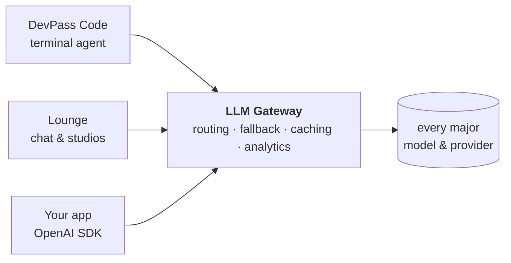

<div align="center">

<picture>
  <source media="(prefers-color-scheme: dark)" srcset="https://raw.githubusercontent.com/theopenco/.github/main/profile/assets/logo-dark.svg">
  
</picture>

### One API for every model — and the products we build on top of it

[](https://github.com/theopenco/llmgateway)
[](https://github.com/theopenco/llmgateway/blob/main/LICENSE)
[](https://docs.llmgateway.io)
[](https://discord.gg/3u7jpXf36B)
[](https://x.com/llmgateway)

**[Website](https://llmgateway.io)** · **[Models](https://llmgateway.io/models)** · **[Providers](https://llmgateway.io/providers)** · **[Pricing](https://llmgateway.io/pricing)** · **[Docs](https://docs.llmgateway.io)** · **[Status](https://status.llmgateway.io)**

</div>

---

We build open-source infrastructure for the multi-model era. One OpenAI-compatible endpoint routes to **[every major provider](https://llmgateway.io/providers)** with automatic fallback, caching, cost analytics and guardrails — and everything else we ship runs on it.



<br />

## Products

|                                                       |                                                                                                            |
| :---------------------------------------------------- | :--------------------------------------------------------------------------------------------------------- |
| **[LLM Gateway](https://llmgateway.io)**              | One API key, every model. Routing, fallback, caching, spend analytics. Cloud or self-hosted.                 |
| **[DevPass](https://devpass.llmgateway.io)**          | One flat coding subscription. Every model, in every agent you already use.                                   |
| **[Lounge](https://lounge.llmgateway.io)**            | The members' lounge for AI — chat, image, video, audio and voice in one membership.                          |
| **[Clanker Support](https://clankersupport.com)**     | Open-source AI support widget that answers from your docs and escalates with full context.                   |

<br />

## ⚡ LLM Gateway

**One endpoint in front of every model.** Point the OpenAI SDK at us, change the base URL, and you're done — no rewrites, no per-provider glue code. Requests retry transparently on a healthy provider when one degrades, and every token lands in your usage dashboard.

<picture>
  <source media="(prefers-color-scheme: dark)" srcset="https://raw.githubusercontent.com/theopenco/.github/main/profile/assets/gateway-dark.png">
  
</picture>

- **Drop-in compatible** — OpenAI-format chat completions, streaming, tool calls, JSON mode, vision, reasoning
- **Automatic fallback** — a degraded provider retries on a healthy one, mid-request
- **Cost-aware analytics** — spend, tokens, cache hits and errors broken down by model, provider and project
- **Pay at provider rates** — flat 5% platform fee on credits, or free with your own keys (BYOK)
- **Guardrails & audit logs** — content filtering, compliance-aware routing, org-wide audit trail
- **Self-host anything** — the core is AGPL-3.0 and ships as a single container

<details>
<summary><b>Try it in 10 seconds</b></summary>

<br />

```bash
curl https://api.llmgateway.io/v1/chat/completions \
  -H "Authorization: Bearer $LLM_GATEWAY_API_KEY" \
  -H "Content-Type: application/json" \
  -d '{
    "model": "gpt-4o",
    "messages": [{ "role": "user", "content": "Hello!" }]
  }'
```

Or self-host the whole stack — dashboard, gateway, playground and docs — in one container:

```bash
docker run -d --name llmgateway \
  -p 3002:3002 -p 4001:4001 \
  -e AUTH_SECRET="$(openssl rand -base64 32 | tr -d '\n')" \
  -e GATEWAY_API_KEY_HASH_SECRET="$(openssl rand -base64 32 | tr -d '\n')" \
  -v llmgateway_postgres:/var/lib/postgresql/data \
  -v llmgateway_redis:/var/lib/redis \
  ghcr.io/theopenco/llmgateway-unified:latest
```

See the [self-hosting guide](https://docs.llmgateway.io) for the full setup.

</details>

<picture>
  <source media="(prefers-color-scheme: dark)" srcset="https://raw.githubusercontent.com/theopenco/.github/main/profile/assets/analytics-dark.png">
  
</picture>

<br />

## 🎟️ DevPass

**One AI coding subscription. Every model. Three flat prices.** Every dollar becomes **$3 of model usage at provider rates** — metered transparently, no token math, no lock-in. Works in [DevPass Code](https://github.com/theopenco/devpass-code) (our first-party terminal agent) and drops into every OpenAI-compatible tool you already run.

<picture>
  <source media="(prefers-color-scheme: dark)" srcset="https://raw.githubusercontent.com/theopenco/.github/main/profile/assets/devpass-dark.png">
  
</picture>

```bash
npm i -g devpass-code   # or: brew install theopenco/tap/devpass-code
devpass-code auth login # opens your browser — no keys to copy, models built in
```

→ **[devpass.llmgateway.io](https://devpass.llmgateway.io)** · [DevPass Code repo](https://github.com/theopenco/devpass-code) · [setup guide](https://llmgateway.io/guides/devpass-code)

<br />

## 🥂 Lounge

**Every frontier model. One membership.** Chat with the models you already pay three subscriptions for, run the same prompt across several at once in group chat, and generate images, video and audio from the same place — with knowledge-base projects, canvas and voice calls built in.

<picture>
  <source media="(prefers-color-scheme: dark)" srcset="https://raw.githubusercontent.com/theopenco/.github/main/profile/assets/lounge-dark.png">
  
</picture>

→ **[lounge.llmgateway.io](https://lounge.llmgateway.io)**

<br />

## Open source

| Repository                                                                        | What it is                                                        |
| :-------------------------------------------------------------------------------- | :---------------------------------------------------------------- |
| **[llmgateway](https://github.com/theopenco/llmgateway)**                          | The gateway, dashboard, playground and docs — the whole platform   |
| **[devpass-code](https://github.com/theopenco/devpass-code)**                      | Terminal coding agent for LLM Gateway (a fork of opencode)         |
| **[llmgateway-templates](https://github.com/theopenco/llmgateway-templates)**      | Starter templates for building AI apps on the gateway              |
| **[agent-skills](https://github.com/theopenco/agent-skills)**                      | Agent skills — image generation best practices and more            |
| **[llmgateway-ai-sdk-provider](https://github.com/theopenco/llmgateway-ai-sdk-provider)** | Vercel AI SDK provider for LLM Gateway                       |
| **[clankersupport-templates](https://github.com/theopenco/clankersupport-templates)** | One-click deploy templates for Clanker Support                   |
| **[homebrew-tap](https://github.com/theopenco/homebrew-tap)**                      | `brew install theopenco/tap/devpass-code`                          |

The core platform is **AGPL-3.0**. Enterprise features under `ee/` are commercially licensed — [get in touch](mailto:contact@llmgateway.io).

<br />

---

<div align="center">

**Building something on it? Come say hi.**

[](https://discord.gg/3u7jpXf36B)
[](https://x.com/llmgateway)
[](https://github.com/theopenco/llmgateway)

<sub>Made by the team behind LLM Gateway · <a href="mailto:contact@llmgateway.io">contact@llmgateway.io</a></sub>

</div>
